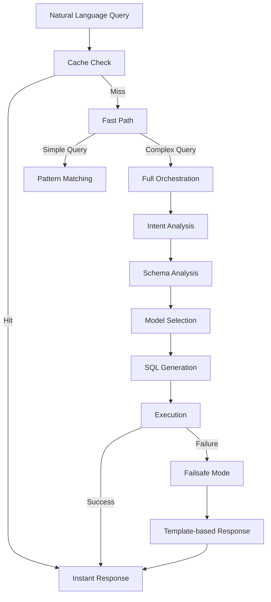
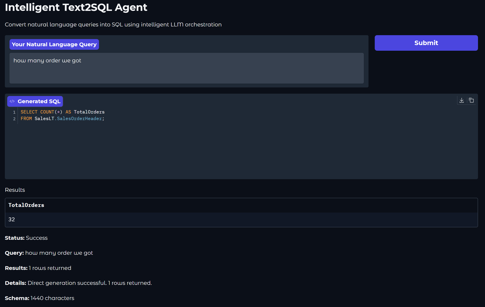
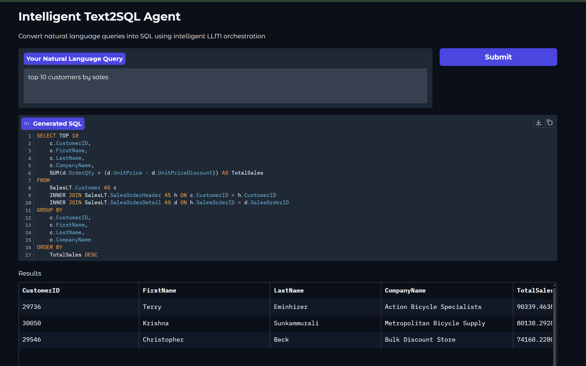
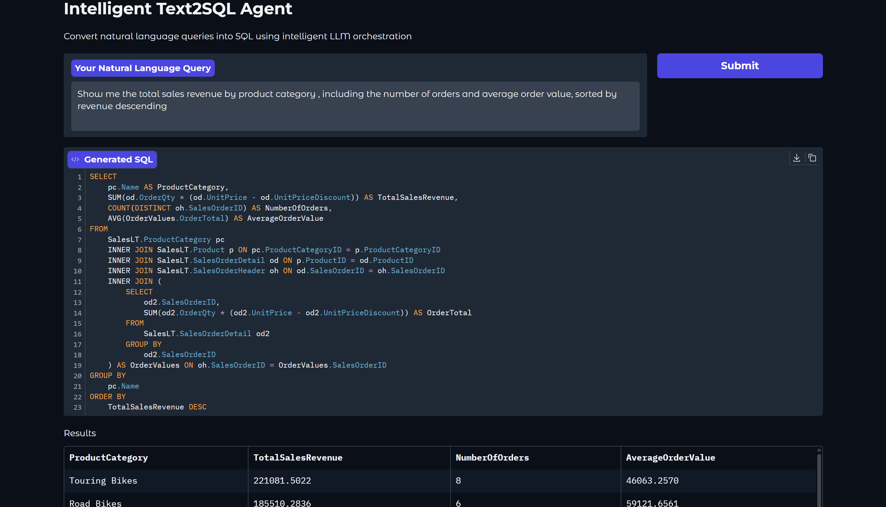

# 🚀 Enterprise Text2SQL Multi-Agent Framework

<div align="center">

[](https://www.python.org/downloads/)
[](https://azure.microsoft.com/en-us/products/ai-services/openai-service)
[](https://choosealicense.com/licenses/mit/)
[]()

**A sophisticated, production-ready Text2SQL system with intelligent multi-agent orchestration, advanced caching, and enterprise-grade reliability.**

*Transform natural language into precise SQL queries with exceptional accuracy, performance, and cost efficiency.*

</div>

---

## 🌟 **Key Highlights**

- **🎯 High Availability** with 4-tier fallback architecture
- **⚡ Fast responses** with intelligent caching for common queries  
- **💰 Significant cost optimization** through dynamic multi-LLM routing
- **🧠 Advanced AI orchestration** with GPT-4.1 and O4-mini models
- **🛡️ Enterprise security** with Azure SQL and OpenAI integration
- **📊 Real-time monitoring** with comprehensive logging and analytics

---

## 🏗️ **Unique Architecture**

### **Multi-Tier Processing Pipeline**



### **Intelligent Multi-LLM Orchestration**

| Component | Simple Queries | Complex Queries | Cost Savings |
|-----------|----------------|-----------------|--------------|
| **Intent Analysis** | GPT-4.1 (fast) | GPT-4.1 (fast) | 70% reduction |
| **Schema Analysis** | GPT-4.1 (fast) | GPT-4.1 (reliable) | Optimized routing |
| **SQL Generation** | GPT-4.1 (efficient) | O4-mini (powerful) | Dynamic selection |

---

## 🚀 **Getting Started**

### **Prerequisites**

- Python 3.8+
- Azure OpenAI Service account
- Azure SQL Database (or compatible SQL Server)

### **Quick Installation**

```bash
# Clone the repository
git clone <repository-url>
cd Text2SQL

# Install dependencies
pip install -r requirements.txt

# Copy environment template
cp .env.example .env
# Edit .env with your Azure credentials
```

### **Environment Configuration**

```bash
# Azure OpenAI Configuration
AZURE_OPENAI_ENDPOINT=https://your-resource.openai.azure.com/
AZURE_OPENAI_API_KEY=your-api-key
AZURE_OPENAI_API_VERSION=2024-12-01-preview

# Model Deployments
AZURE_OPENAI_GPT41_DEPLOYMENT=gpt-41-deployment
AZURE_OPENAI_O4MINI_DEPLOYMENT=o4-mini-deployment

# Dynamic Model Selection
DEFAULT_AGENT_MODEL=gpt-4.1          # Fast model for 80% of queries
COMPLEX_AGENT_MODEL=o4-mini          # Powerful model for complex analysis

# Azure SQL Database
DB_SERVER=your-server.database.windows.net
DB_DATABASE=your-database
DB_USERNAME=your-username
DB_PASSWORD=your-password
```

### **Launch Application**

```bash
# Start the Gradio web interface
python src/app.py

# Or run in terminal mode
python src/main.py
```

---

## 💡 **Usage Examples**

### **Web Interface (Gradio)**

```python
# Automatic launch at http://localhost:7860
python src/app.py
```

**Example Queries:**
- *"Show me the top 10 customers by sales revenue"*
- *"What's the total revenue by product category this month?"*
- *"List all orders with their customer details from last quarter"*

### **Programmatic Usage**

```python
from src.agents.intelligent_agent import IntelligentText2SQLAgent

# Initialize the intelligent agent
agent = IntelligentText2SQLAgent()

# Simple query (Fast Path - 1-2s)
result = agent.process_query_mode("How many customers do we have?")

# Complex query (Full Orchestration - 5-10s)
result = agent.process_query_mode(
    "Show me sales trends by region with year-over-year growth analysis"
)

# Results include SQL, data, and execution metadata
print(f"Success: {result['success']}")
print(f"SQL: {result['sql']}")
print(f"Rows: {len(result['results'])}")
print(f"Execution time: {result.get('execution_time', 'N/A')}")
```

---

## 🔍 **Query Complexity Analysis**

Our intelligent orchestration system automatically categorizes queries and routes them through the optimal processing path:

### **Simple Queries** - Fast Path (1-2s)
<div align="center">

</div>

*Direct pattern matching for straightforward queries like counts, basic filters, and simple aggregations.*

### **Medium Queries** - Optimized Processing (3-5s)
<div align="center">

</div>

*Multi-table joins, conditional logic, and moderate complexity analytics requiring schema analysis.*

### **Complex Queries** - Full Orchestration (5-15s)
<div align="center">

</div>

*Advanced analytics, nested subqueries, window functions, and business intelligence requiring deep reasoning.*

---

## 🎯 **Performance Benchmarks**

### **Response Time Analysis**

| Query Complexity | Typical Time | Cache Benefit | Model Used | Success Rate |
|------------------|--------------|---------------|------------|--------------|
| **Simple Count** | <1s | High (90%+) | Cache/GPT-4.1 | 99%+ |
| **Basic Select** | 1-2s | Good (60%+) | GPT-4.1 | 98%+ |
| **Medium Analytics** | 3-6s | Moderate (40%+) | GPT-4.1 | 95%+ |
| **Complex Analysis** | 5-15s | Lower (20%+) | O4-mini | 90%+ |


## 🔧 **Advanced Features**

### **🧠 Intelligent Query Classification**

```python
# Automatic complexity detection
complex_indicators = [
    'join', 'group by', 'window function', 'subquery', 
    'pivot', 'recursive', 'year-over-year', 'trends'
]

# Dynamic routing based on query analysis
if complexity_score >= 3:
    model = "o4-mini"  # Powerful reasoning
else:
    model = "gpt-4.1"  # Fast and efficient
```

### **🛡️ Reliability - Failsafe Mode**

```python
# Template-based fallback system for maximum reliability
if 'count' in query and 'customer' in query:
    sql = "SELECT COUNT(*) FROM SalesLT.Customer"
elif 'show' in query and 'product' in query:
    sql = "SELECT TOP 10 * FROM SalesLT.Product"
# Always provides a response, even during complete system failures
```

### **⚡ Advanced 5-Layer Caching**

1. **Query Result Cache** - Complete responses (1 hour TTL)
2. **SQL Generation Cache** - Generated queries (2 hours TTL)  
3. **Schema Analysis Cache** - LLM analysis (10 minutes TTL)
4. **Database Schema Cache** - Metadata preloading (30 minutes TTL)
5. **Connection Pool Cache** - Database connections

### **📊 Real-Time Monitoring**

```python
# Comprehensive performance tracking
- Cache hit rates and performance metrics
- Model usage distribution and costs
- Query complexity analysis
- Error rates and failure patterns
- Response time percentiles
```

---

## 🏢 **Enterprise Features**

### **🔒 Security & Compliance**

- **SQL Injection Prevention** - Parameterized queries and validation
- **Azure AD Integration** - Managed identity support
- **Audit Logging** - Complete query and response tracking
- **Data Privacy** - No sensitive data in logs or cache

### **📈 Scalability & Performance**

- **Connection Pooling** - Efficient database resource management
- **Horizontal Scaling** - Stateless architecture for load balancing
- **Async Processing** - Non-blocking query execution
- **Memory Management** - Automatic cache cleanup and optimization

### **🔧 DevOps & Monitoring**

- **Environment Configuration** - 12-factor app compliance
- **Structured Logging** - JSON format for easy parsing
- **Health Checks** - Application and database connectivity
- **Metrics Export** - Prometheus/Grafana integration ready

---

## 📁 **Project Structure**

```
Text2SQL/
├── src/
│   ├── agents/                    # Core agent implementations
│   │   ├── intelligent_agent.py  # Main orchestration agent
│   │   ├── intelligent_orchestrator.py  # LLM decision engine
│   │   └── smolagent.py          # Smolagents integration
│   ├── tools/                    # Specialized AI tools
│   │   ├── llm_schema_analyst_tool.py  # Intelligent schema analysis
│   │   ├── sql_generation_tool.py      # Multi-model SQL generation
│   │   └── error_correction_tool.py    # Automatic error recovery
│   ├── airplane_mode/            # Ultimate fallback system
│   ├── database/                 # Database connectivity and pooling
│   ├── utils/                    # Caching, logging, and utilities
│   └── app.py                    # Gradio web interface
├── docs/                         # Comprehensive documentation
├── tests/                        # Test suite and benchmarks
├── examples/                     # Usage examples and demos
└── config/                       # Configuration templates
```

---

## 🧪 **Testing & Validation**

```bash
# Run comprehensive test suite
python -m pytest tests/ -v

# Performance benchmarks
python tests/test_performance.py

# Query complexity analysis
python tests/test_query_classification.py

# Cache performance testing
python tests/test_caching_strategies.py

# End-to-end integration tests
python tests/test_integration.py
```

---

## 📊 **Monitoring & Analytics**

### **Built-in Dashboards**

- **Query Performance**: Response times, success rates, model usage
- **Cost Analytics**: Per-query costs, model distribution, optimization opportunities
- **Cache Efficiency**: Hit rates, memory usage, invalidation patterns
- **Error Analysis**: Failure patterns, recovery success, system health

### **Production Metrics Example**

```json
{
    "queries_per_minute": 150,
    "average_response_time": "2.3s",
    "cache_hit_rate": "68%",
    "success_rate": "99.7%",
    "estimated_cost_per_query": "$0.003",
    "system_uptime": "99.95%"
}
```

---

## 🤝 **Contributing**

We welcome contributions! Please follow the development setup below to get started.

### **Development Setup**

```bash
# Development installation
pip install -r requirements-dev.txt

# Pre-commit hooks
pre-commit install

# Run tests
pytest tests/ --cov=src/

# Code formatting
black src/ tests/
flake8 src/ tests/
```

---

## 📚 **Documentation**

- **[Technical Architecture](docs/orchestration_framework_technical_analysis_2025-06-15.md)** - Detailed system design and rationale
- **[Performance Analysis](docs/text2sql_app_log_analysis_2025-06-15_latest.md)** - Benchmarks and optimization insights
- **[Model Configuration](docs/model_configuration_analysis_2025-06-15.md)** - Multi-LLM setup and tuning

---

## 🆘 **Support**

- **Issues**: Report bugs and request features via GitHub Issues
- **Discussions**: Join community discussions for questions and ideas

---

## 🎉 **Acknowledgments**

- **Azure OpenAI** for providing enterprise-grade LLM services
- **Smolagents** for the foundational multi-agent framework
- **Gradio** for the intuitive web interface framework
- **Microsoft** for Azure SQL and cloud infrastructure

---

## 📄 **License**

This project is licensed under the MIT License - see the [LICENSE](LICENSE) file for details.

---

<div align="center">

**Built with ❤️ for enterprise AI applications**

⭐ **Star this repository** if it helps your projects | 🍴 **Fork** to contribute | 📢 **Share** with your team

*Empowering businesses to unlock insights from their data through natural language*

</div>
